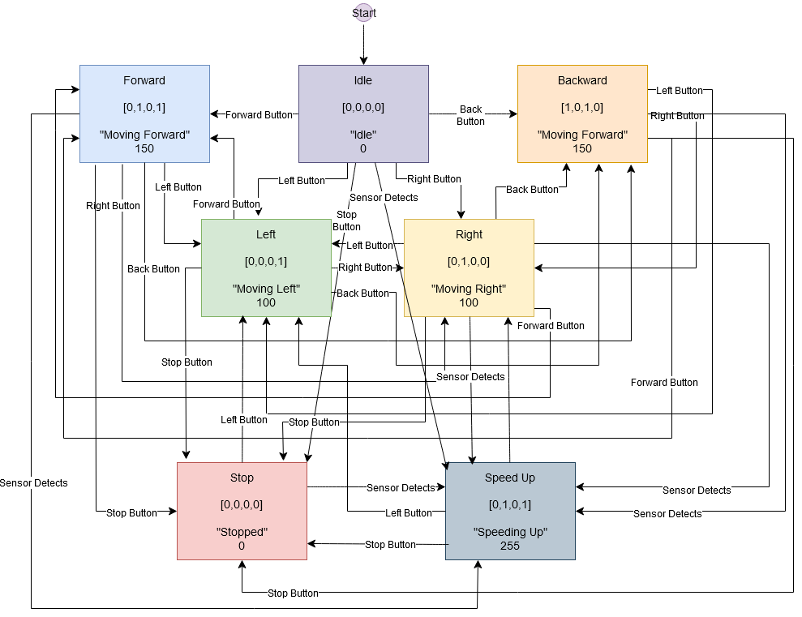

# IR-Controlled Sumo Robot
IR-controlled sumo robot with FSM-based movement logic and ultrasonic proximity-based speed adjustment

━━━━━━━━━━━━━━ ✦ ✧ ✦ ━━━━━━━━━━━━━━

## 🟣 Overview

This project focuses on the design and implementation of an IR-controlled sumo robot capable of navigating a sumo ring and responding to opposing robots. The system uses a finite state machine (FSM) to control robot movement based on IR remote inputs and ultrasonic sensor readings.

The ultrasonic sensor enables the robot to adjust its speed when another object is detected within a close range. The system successfully demonstrates IR-based control, sensor integration, and FSM-based decision-making.
  

## 🟣 Key Features

- IR remote-controlled movement system
- Ultrasonic sensor-based proximity detection
- FSM-based movement control logic
- Dynamic speed adjustment based on obstacle distance
- Motor control using L298N driver
- Movement states: Forward, Backward, Left, Right, Stop, Idle, Speed Boost
  

## 🔧 Hardware Components

| Component | Model | Quantity |
|-----------|-------|----------|
| Microcontroller | Arduino Uno | 1 |
| Motor Driver | L298N H-Bridge | 1 |
| DC Motors | 6V Gear Motors | 2 |
| Ultrasonic Sensor | HC-SR04 | 1 |
| IR Receiver | IR Sensor Module | 1 |
| IR Remote | Standard IR Remote | 1 |
| Power Supply | Battery Pack | 1 |

  

## 🟣 Finite State Machine (FSM)

The robot operates using the following FSM states:  

  

## 🟣 Control Logic Summary

- IR sensor decodes remote commands and changes robot state
- Ultrasonic sensor continuously measures distance
- If distance < 20 cm → robot enters SPEED_UP state (max speed)
- Otherwise robot follows IR-based movement commands
- FSM ensures structured and predictable behavior
  

## 🟣 System Behavior Summary

- Robot responds to IR remote commands in real-time
- Movement is controlled via FSM-based logic
- Ultrasonic sensor modifies speed dynamically
- All motor actions are executed through L298N driver
- System meets all defined functional requirements
  

## 🟣 Future Improvements

- Improve IR sensor reliability under varying lighting conditions
- Enhance ultrasonic accuracy for edge-case detection
- Improve power efficiency for longer runtime
- Add additional sensor-based safety improvements (optional line detection)
  

## 🟣 Technologies Used

- Arduino IDE
- C++ (Embedded Systems)
- IRremote Library
- Ultrasonic Sensor (HC-SR04)
- L298N Motor Driver
